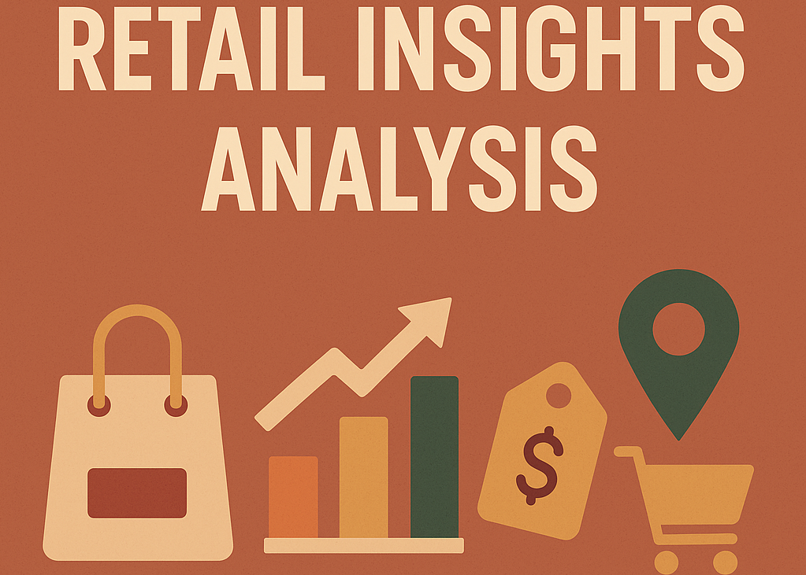
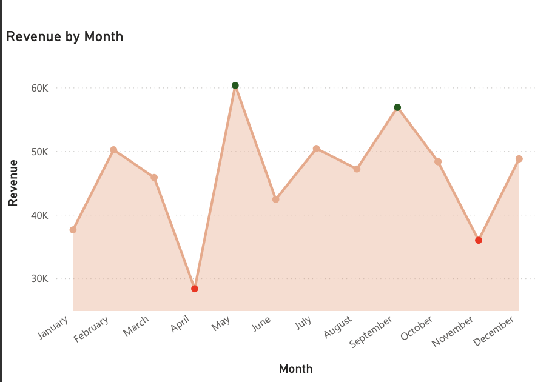
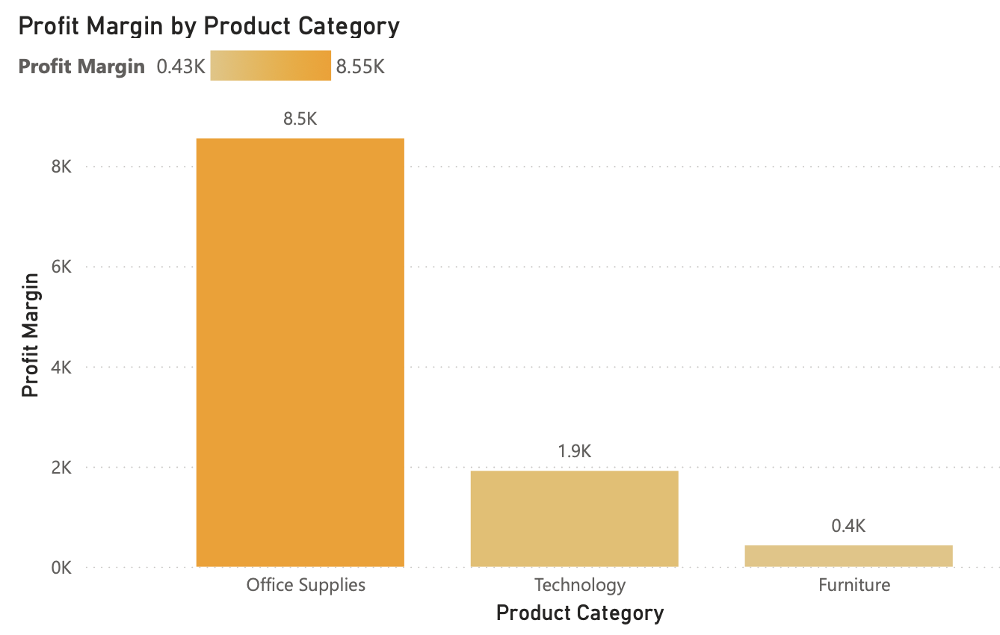
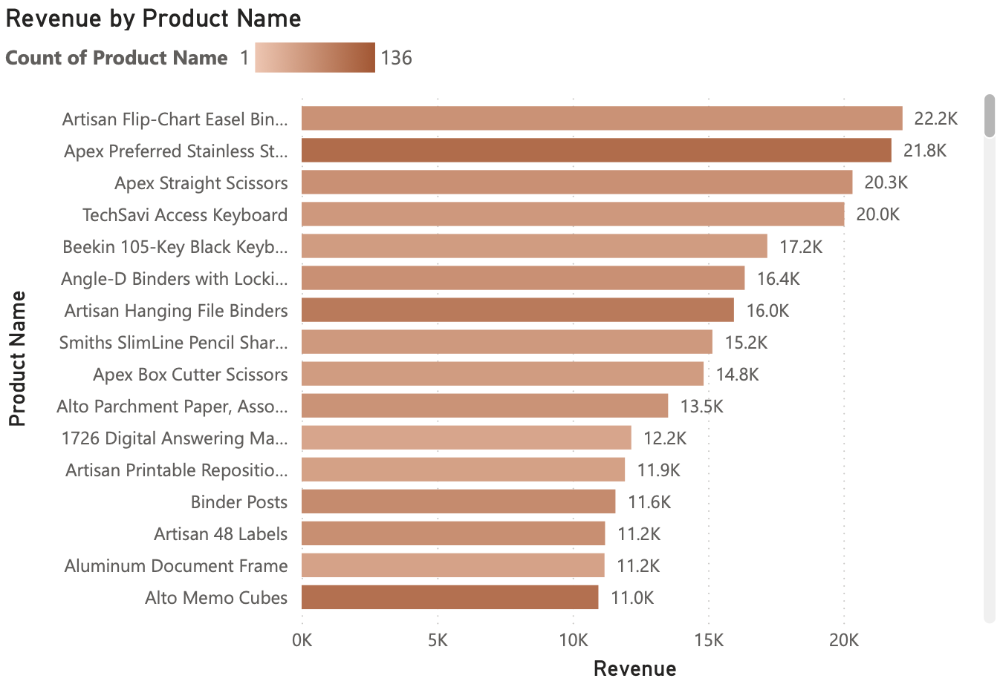
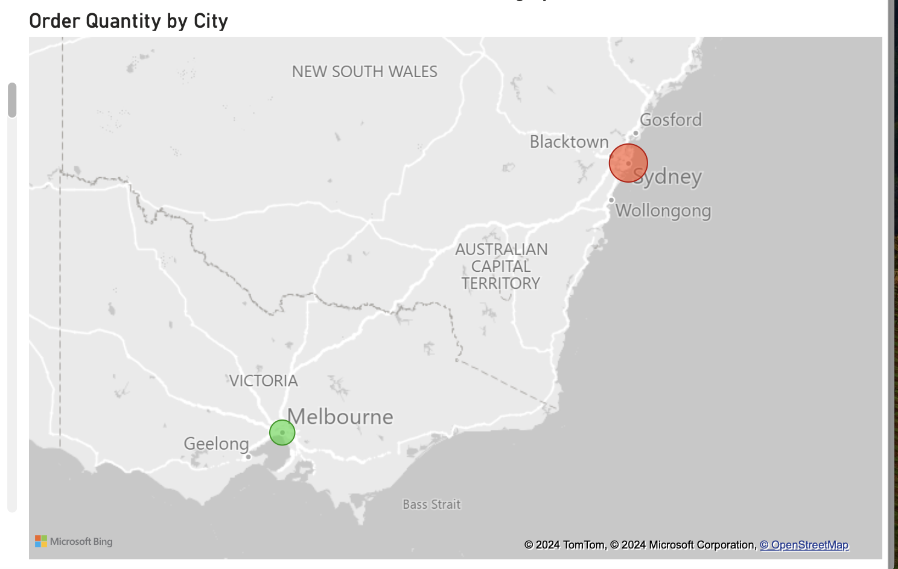
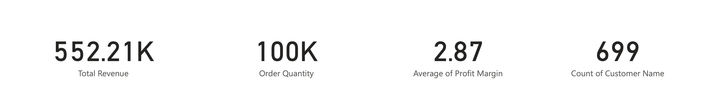
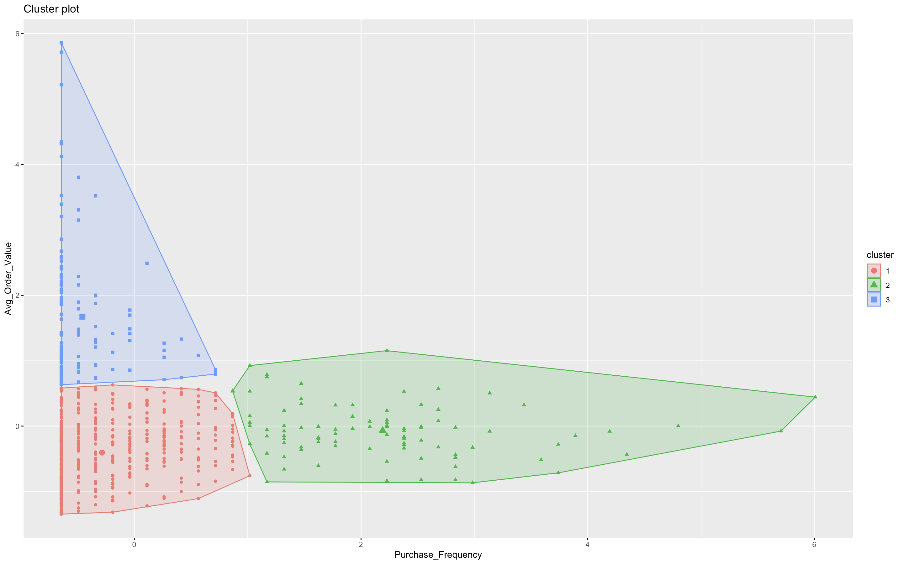

# Retail Insights Analytics 
Data-driven analysis of retail sales data to uncover patterns, segment customers, and drive business strategy through actionable insights.

**Dataset:** Retail Insights: A Comprehensive Sales Dataset  
**Source:** [Kaggle Dataset](https://www.kaggle.com/datasets/rajneesh231/retail-insights-a-comprehensive-sales-dataset/data)
---
##  Table of Contents

- [Part 1: Sales Performance Analysis](#part-1-sales-performance-analysis)
  - [Objective](#objective)
  - [Data Cleaning & Preparation](#data-cleaning--preparation)
    - [1. Handling Missing Values](#1-handling-missing-values)
    - [2. Ensuring Data Consistency](#2-ensuring-data-consistency)
    - [3. Outlier Detection & Removal](#3-outlier-detection--removal)
    - [4. Exporting Cleaned Data](#4-exporting-cleaned-data)
  - [Visualizations & Insights](#visualizations--insights)

- [Part 2: Customer Segmentation & Retention](#part-2-customer-segmentation--retention)
  - [Segmentation Objective](#segmentation-objective)
  - [Clustering Strategy](#clustering-strategy)
    - [1. Data Aggregation](#1-data-aggregation)
    - [2. K-Means Clustering](#2-k-means-clustering)
  - [Cluster Insights](#cluster-insights)

- [🔗 Links to Code](#-links-to-code)
---
## Part 1: Sales Performance Analysis

### Objective
Analyze sales performance and gain actionable insights into revenue trends, profit margins, product performance, and order distribution across locations.

### Data Cleaning & Preparation
The dataset contains sales transactions from a retail company, including details about orders, customers, products, pricing, and shipping. Pandas library was used to clean and analyze the data.

#### 1. Handling Missing Values
A search for missing values was conducted using the following statement:
```python
sales_df['Order Quantity'] = sales_df['Order Quantity'].fillna(sales_df['Order Quantity'].mean())
```
A critical missing value was identified in the Order Quantity column. Imputation was used to fill this gap:
```python
# Replace the Order Quantity missing value with the column mean
sales_df['Order Quantity'] = sales_df['Order Quantity'].fillna(sales_df['Order Quantity'].mean())
```

#### 2. Ensuring Data Consistency
The data types of all variables were verified to ensure consistency before performing calculations. For instance, date-related columns were converted to a datetime format:
```python
# Modify the Date column to a datetime data type to ensure consistency
sales_df['Order Date'] = pd.to_datetime(sales_df['Order Date'], dayfirst = True)
sales_df['Ship Date'] = pd.to_datetime(sales_df['Ship Date'], dayfirst = True)
```

#### 3. Outlier Detection & Removal
Outliers were identified and removed to prevent them from distorting the analysis. Summary statistics were inspected using the describe() function, revealing significant differences between the mean and median, as well as the minimum and maximum values. This indicates the presence of outliers primarily due to bulk orders that are unlikely to recur. Outlier removal was performed as follows:
```python
columns_to_check = ['Cost Price', 'Retail Price', 'Profit Margin', 'Sub Total', 'Discount $', 'Order Total', 'Total']
Q1 = sales_df[columns_to_check].quantile(0.25)
Q3 = sales_df[columns_to_check].quantile(0.75)
IQR = Q3 - Q1
lower_bound = Q1 - 1.5 * IQR
upper_bound = Q3 + 1.5 * IQR
filtered_sales = sales_df[~((sales_df[columns_to_check] < lower_bound) | (sales_df[columns_to_check] > upper_bound)).any(axis=1)].copy()
```

#### 4. Exporting Cleaned Data  
Cleaned data exported as `.csv` for Power BI.

➡️ Full Cleaning code: [SalesData_Cleaning.ipynb](SalesData_Cleaning.ipynb)

---

### Visualizations & Insights

- **Revenue by Month:** Seasonal peaks in May, September, December
  
- **Profit by Category:** Office Supplies drive highest margins
  
- **Top Products:** Heavy reliance on a few key SKUs

- **Regional Orders:** Sydney outperforms other cities
  
- **Customer Base:** 699 customers with low average margin


**Business Strategy Recommendations:**
- Promote during off-peak months
- Reevaluate underperforming products
- Improve margins and expand customer base

---

## Part 2: Customer Segmentation & Retention

### Segmentation Objective
Segment customers using purchase frequency and order value to tailor marketing, improve retention, and optimize targeting.

### Clustering Strategy

#### 1. Data Aggregation
```r
customer_data <- sales_data %>%
  group_by(Customer.Name, State) %>%
  summarise(
    Purchase_Frequency = n(),
    Avg_Order_Value = mean(Total)
  )
```

#### 2. K-Means Clustering
```r
set.seed(123)
kmeans_result <- kmeans(customer_data_scaled, centers = 3)
customer_data$Cluster <- as.factor(kmeans_result$cluster)
```

---

### Cluster Insights



- **Cluster 1 (Red):** Low frequency + low spend → Target with re-engagement
- **Cluster 2 (Green):** High frequency + medium spend → Boost with loyalty programs
- **Cluster 3 (Blue):** Medium frequency + high spend → Retain with VIP treatment

**Retention Strategy Recommendations:**
- Discounts and engagement for Cluster 1  
- Loyalty rewards for Cluster 2  
- Exclusive perks for Cluster 3  

➡️ Full R code: [Sales_Data_Clustering.R](Sales_Data_Clustering.R)

---

## 🔗 Links to Code

- [Data Cleaning Notebook (Python)](SalesData_Cleaning.ipynb)  
- [Customer Segmentation Script (R)](Sales_Data_Clustering.R)
